# Tutoriais
Tutorias com finalidade de ensino do uso de ferramentas de programação (Git, Atom, etc).

## Git Bash + Atom

### Como criar um novo repositório

* Abra sua página do [GitHub](www.github.com) e no canto superior direito clique no pequeno botão de **+**, então selecione `New repository`:

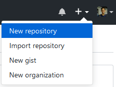

* Preencha:
    * **Name**: Nome do seu repositório (que também será o link para ele).
    * **Description**: É opcional mas recomendado adicionar uma descrição.
    * **Privacidade**: Toda conta GitHub pode criar repositórios públicos, mas caso deseje é possível ativar a opção de repositório privados. Estudantes podem ter repositórios privados ilimitados caso requisitem seu [student developer pack](https://education.github.com/pack).
    * **README**: O GitHub oferece a opção de inicializar seu repositório com um arquivo README em formato [https://guides.github.com/features/mastering-markdown/](Markdown), este arquivo é onde iremos descrever nosso repositório.
    * **.gitignore**: Este arquivo serve para dizer quais tipos de arquivos o git deve ignorar ao analisar seu projeto. Por exemplo, se você programa em python não é recomendado rastrear a versão de arquivos de cache (*__pycache__/*) dos seus pacotes, pois eles vão apenas dar volume e atrapalhar no gerenciamento das versões do seu projeto.
    * **License**: É uma boa prática colocar alguma licença open-source sobre o seu código, isso dirá quais as permissões que quem tiver acesso a ele terá. Leia mais em [choosealicense.com](https://choosealicense.com/licenses/)

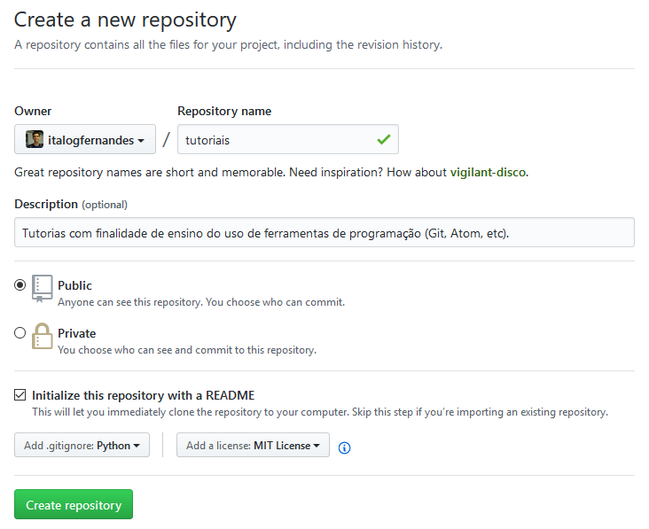

* MIT License File:

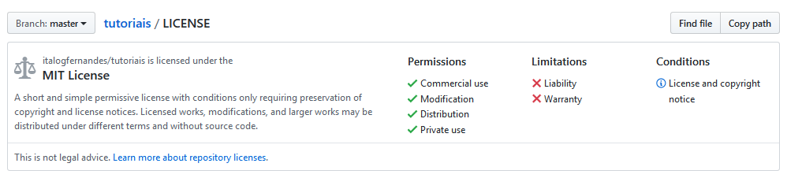

* .gitignore para python.

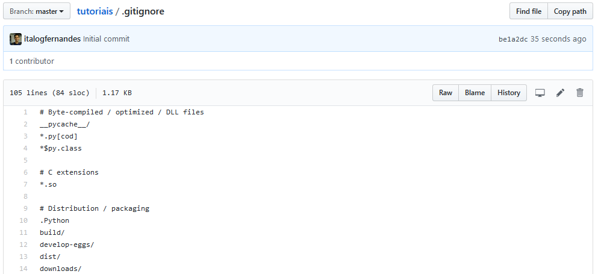

### Clonando o repositório para seu computador

* Com o repositório criado, clique em **Clone or download** e selecione a sua opção de download (HTTPS ou [SSH](https://help.github.com/articles/connecting-to-github-with-ssh/)), na opção https será requisitada suas credenciais para realizar um push, selecione o copie o endereço que aparecerá.

* Selecione uma pasta no seu computador e clique com o botão direito em um espaço vazio.

* No terminal aberto digite `git clone https://github.com/<username>/<repository_name>.git` e pressione enter para executar o comando.

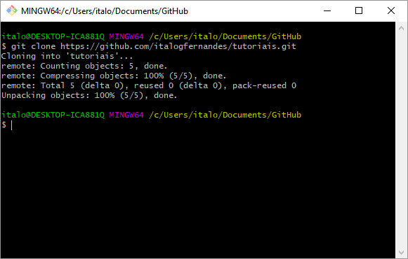

* Uma nova pasta será criada com o nome do seu repositório e os arquivos presente nela serão clonados para seu computador. (A pasta .git é utilizada pelo sistema para gerenciar as versões do seu projeto)

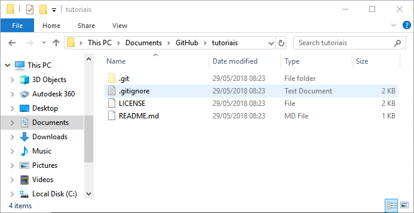

### Usando o Atom

* Abra o Atom e selecione **Open Folder**. Navegue até a pasta que você clonou do GitHub e selecione-a.

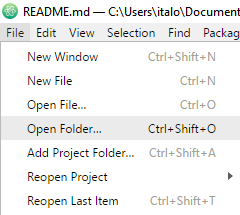

* Sua pasta aparecerá no Atom com um ícone de repositório, caso você editar algum arquivo ele ficará destacado, verde para arquivos novos, amarelo para arquivos modificados e vermelho para arquivos excluídos.

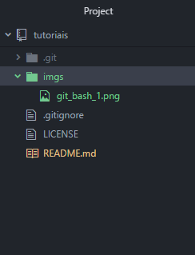

* Todos as ferramentas do Atom podem ser acessadas digitando `Ctrl+Shift+P` e pesquisando pelo nome da ferramenta.

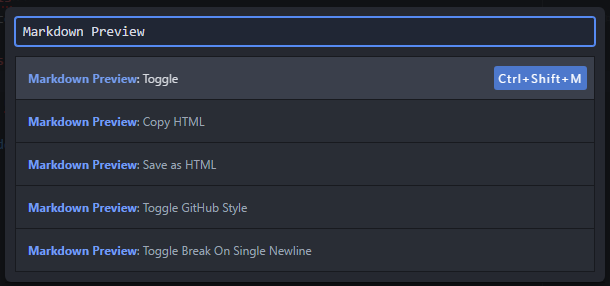

* Um exemplo é o Preview de arquivos formatados com markdown.

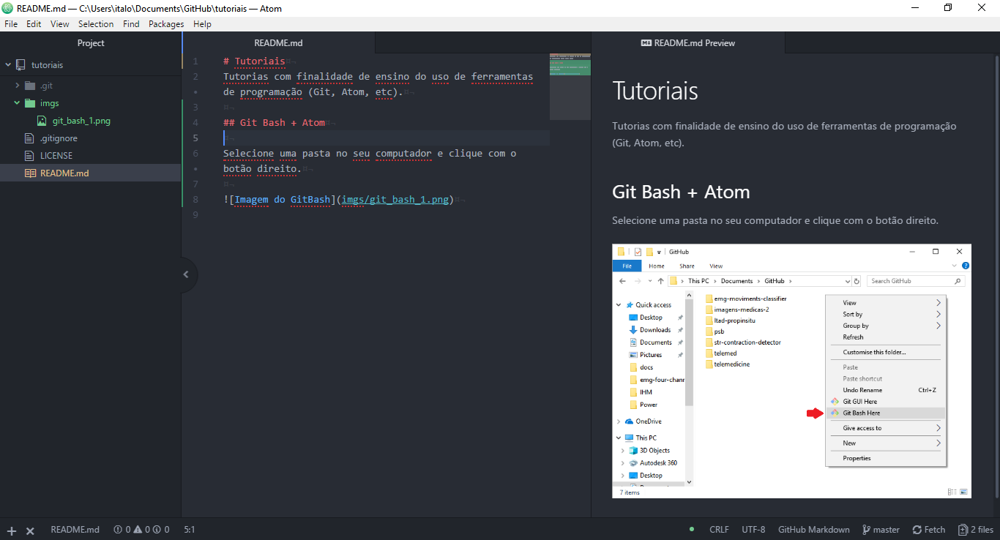

* Para acessar o painel do Git, você pode pesquisar por `Git Tab` na paleta de comandos, acessar o **menu View** ou então clicar no pequeno ícone no **canto inferior direito** onde está escrito a quantidade de arquivos modificados.

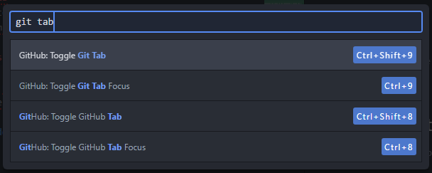

* Este painel é dividido em 3 partes:
    * **Unstaged Changes**: Suas modificações em geral.
    * **Staged Changes**: As modificações que você selecionou para salvar em um Commit.
    * **Commits**: Uma entrada de texto onde você pode inserir uma mensagem e criar um novo commit e a lista de commits deste repositório.

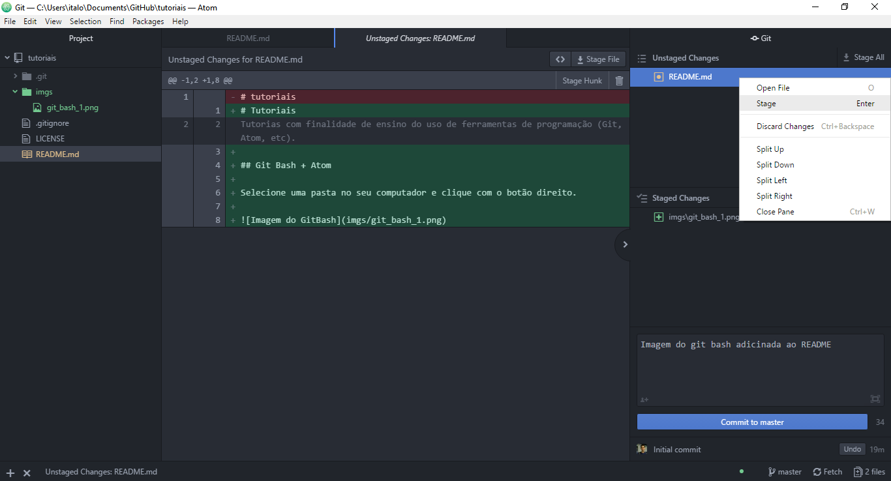

* Após realizar alguma modificação selecione os arquivos que deseja dar um "Stage", isso equivale ao comando `git add <nome_do_arduino>`. Digite uma mensagem que descreva brevemente suas modificações.

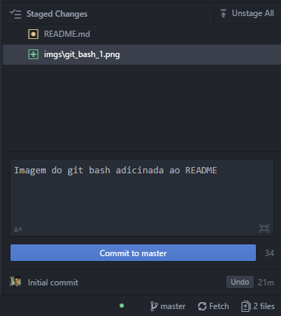

* Clique em commit to master e seu commit aparecerá na lista, note também o surgimento de um número próximo a palavra **Push** no inferior da tela. O comando `git push` envia suas modificações para o repositório online do GitHub (sua origin). Este comando se complementa com o `git  pull` que busca os commits não estão no seu computador (remote).

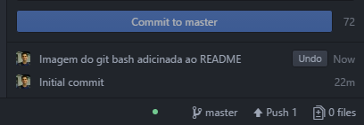

* Depois do push você poderá ver suas modificações no endereço do repositório online.

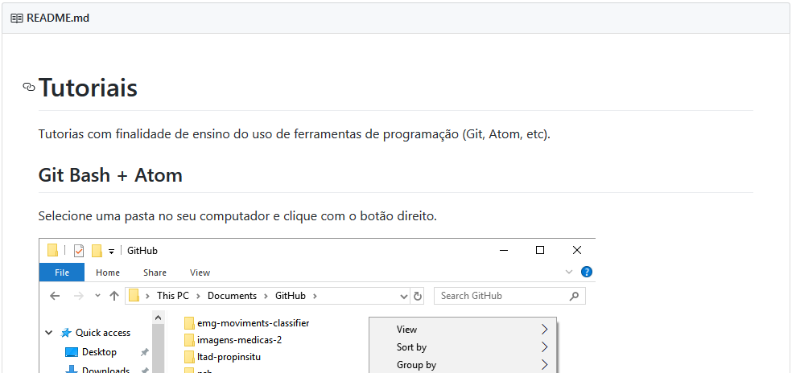

### Configurando uma GitHub Page

Acesse para saber mais sobre o [GitHub Pages](https://pages.github.com/).

* No seu repositório acesse o menu de configurações.

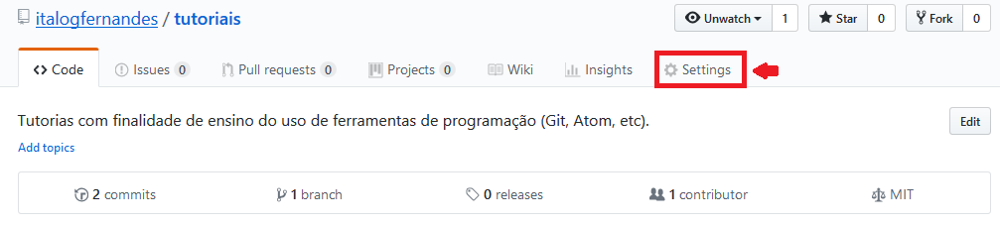

* Navegue até a parte que configura o GitHub Pages. Selecione de qual arquivo você deseja que GitHub gere sua página e salve. Ela já estará disponível em `username.github.io/repositoryname`, para ficar mais agradavél a vista selecione um tema.

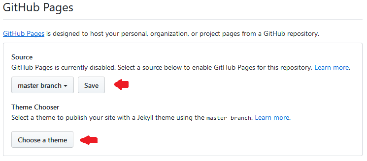

* Alguns exemplos de temas disponíveis.

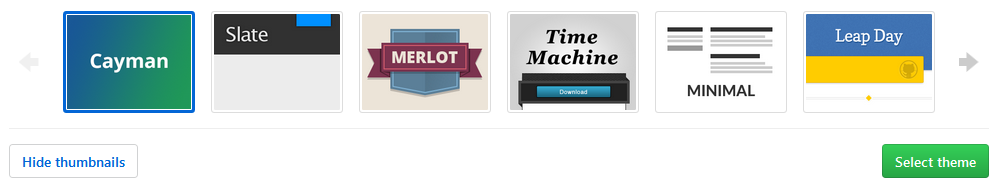

* Link onde minha página foi publicada.

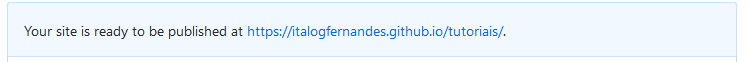

## Autor

* Ítalo Fernandes - [italogfernandes.github.io](https://italogfernandes.github.io)
