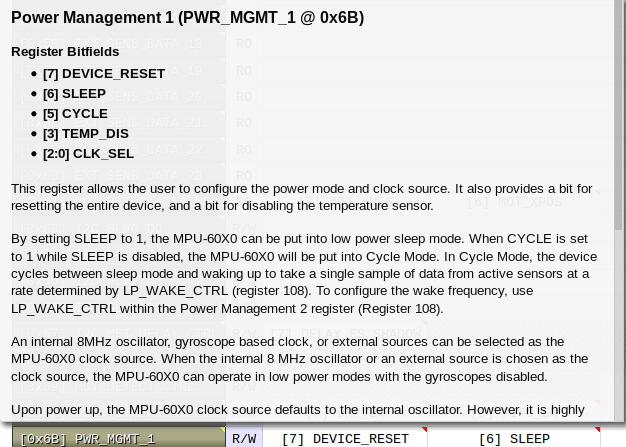
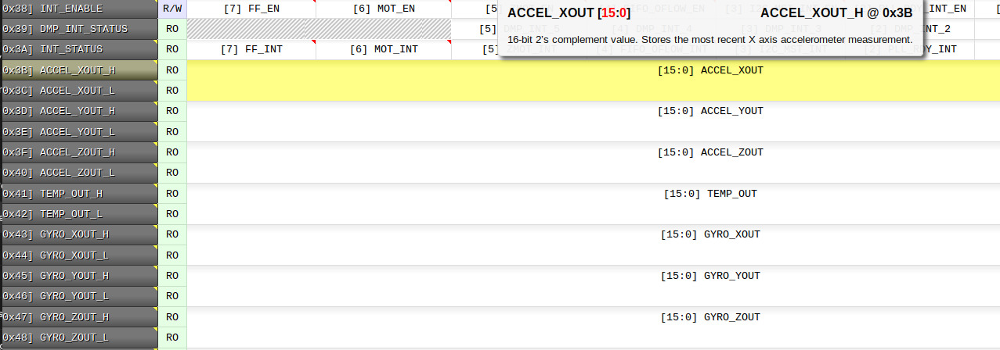
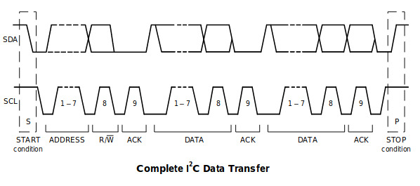
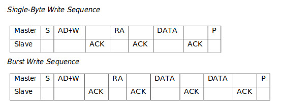
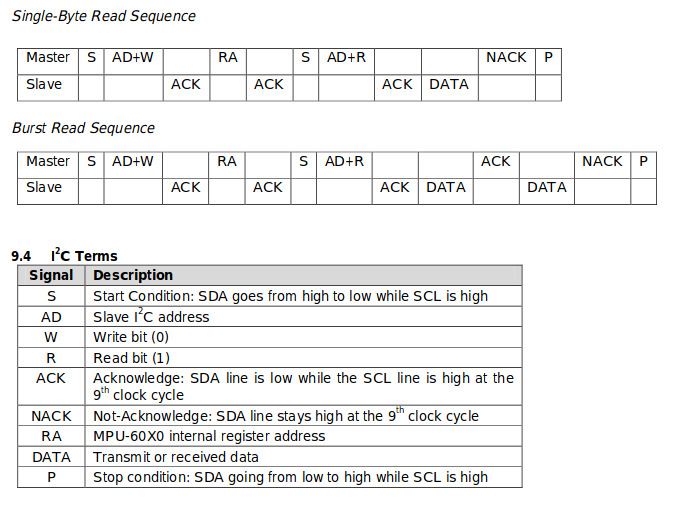

# MPU6050 in a nutshell
Resumo desorganizado de como resolver as tretas com o nosso querido MPU6050.

## Paraiso da desorganizacao

[MPU6050_DMP6.ino](https://github.com/jrowberg/i2cdevlib/blob/master/Arduino/MPU6050/examples/MPU6050_DMP6/MPU6050_DMP6.ino)
Descomenta ql parte tu quer


[MPU6050_calibration.ino](https://github.com/italogsfernandes/rastreamento-inercial/blob/master/Codigos%20para%20consulta%20e%20referecias/Firmware/Arduino/MPU6050_calibration/MPU6050_calibration.ino)

[mpu6050_complete.ino](https://github.com/italogsfernandes/rastreamento-inercial/blob/master/Codigos%20para%20consulta%20e%20referecias/Firmware/Andrei-pu6050_complete/mpu6050_complete/mpu6050_complete.ino)

[Arduino_EMG_INERTIAL_Com_Fio.ino](https://github.com/BIOLAB-UFU-BRAZIL/cobec-competicao/blob/master/SistemaDeAquisicao/Arduino_EMG_INERTIAL_Com_Fio/Arduino_EMG_INERTIAL_Com_Fio.ino)

Isso resolve
Se precisar de precisão e tal
Tu usa esse outro:

Codigos usando algoritmo de madgwick: [GY88_AND_DEMUX](https://github.com/italogsfernandes/rastreamento-inercial/tree/master/Firmware/GY88_AND_DEMUX)
Esse é o brabo

nao tem isso no datasheet nao kk
Pra pegar os dados filtrados pre processados e com altas coisas la
vc usa uma coisa chamada DMP
mas se quiser so os dados brutos
pra vc fazer oq bem entender
so usar comunicacao I2C
adiciona a biblioteca de i2c
`#include<Wire.h>`
inicia o i2c
`Wire.begin();`
"Liga" o sensor, tipo, tu configura ele pra ficar lendo:
```C
Wire.beginTransmission(0x68); Wire.write(0x6B); Wire.write(0); Wire.endTransmission(true);
```
No loop, vc le os dados do sensor: 
Requisita a leitura no registro 0x3B (inicio do vetor de dados na memoria do mpu6050):
```C
Wire.beginTransmission(0x68); Wire.write(0x3B); Wire.endTransmission(false); Wire.requestFrom(0x68,14,true); 
```
Entao le:
```C
Aceleracao_X = Wire.read() << 8 | Wire.read(); 
Aceleracao_Y = Wire.read() << 8 | Wire.read(); 
Aceleracao_Z = Wire.read() << 8 | Wire.read(); 
Temperatura = Wire.read()<<8|Wire.read(); Temperatura = Temperatura/340.00+36.53;
Giroscopio_X = Wire.read() << 8 | Wire.read(); 
Giroscopio_Y = Wire.read() << 8 | Wire.read();
Giroscopio_Z = Wire.read() << 8 | Wire.read();
```
`Wire.read()` -> Le 8 bytes do barramento i2c
Tu esta lendo 8 bytes, entao empurrando ele 8 casas a esquerda, depois somando com mais 8 bytes:
Le 8 bytes: __ __ 1111 1111
add 8 zeros a esquerda: 1111 1111 0000 0000
Le mais 8 bytes: __ __ 1111 1111
Faz a operacao | (ou) (msm coisa de somar nesse caso pq soma com zeros: 
1111 1111 0000 0000 OU __ __ 1111 1111 = 1111 1111 1111 1111
No final vc tem um numero de 16 bits lindao
obs: tu tem que ler a temperatura tbm nessa ordem e ignorar ela, pra poder mudar o endereco de registrador
teve um povo ae que fez uns codigos explicando esse sensor: https://www.i2cdevlib.com/devices/mpu6050#source


se tu olhar no mapa de registradores:
vai ver que o 0x6B é o power management 1








E quanto vc escreve um "0" nele vc esta configurando o dispositivo pra: sair do sleep mode e selecionando o clock interno dele
0x68 é o endereco do sensor no barramento I2C, mas se  vc ligar a perninha de addr dele em nivel alto ele vira 0x69, e tu pode usar isso pra conectar varios sensores no mesmo arduino
ou uC

Os dados que vc le comecam no 0x3B, e vc vai lendo ate chegar na ultima informacao do gyroscopio

na pag35 do datasheet ele fala como usar o I2C pra ler e escrever dados nos registros do MPU6050
```
escrevendo o valor 0 (0000 0000) no registro de endereco 0x6B PWR_MNGT_1 usando o arduino: Wire.beginTransmission(0x68); //Master envia Start + Address
Wire.write(0x6B); // Envia register address
Wire.write(0); // Envia DATA
Wire.endTransmission(true); // Stop Condition
```
Lendo o valor do register 0x3B (onde fica armazenado o X do acelerometro):
Requisita a leitura no registro 0x3B (inicio do vetor de dados na memoria do mpu6050):
```
Wire.beginTransmission(0x68);  //Master envia Start + Address
Wire.write(0x3B); // Envia register address
Wire.endTransmission(false); // Segura o barramento pra nao fechar a conexao antes de enviar uma requisicao de leitura
Wire.requestFrom(0x68, 2, true);  // Envia Device Address + Read bit (1) e configura o arduino pra segurar o barramento pelos proximos 2 bytes e depois de 2 bytes enviar uma stop condition (true) 
Aceleracao_X_MSB = Wire.read(); // primeiro bytes DATA 8 bits (1bytes)  received data
Aceleracao_X_LSB = Wire.read();  // segundo byte DATA 8 bits (1bytes)  received data
// Automaticamente depois de 2 bytes ele envia uma STOP Condition pq voce definiu com "Wire.requestFrom(0x68, 2, true);"
```

dps pra converter tu junta o MSB com o LSB, (faz o complemento de 2 se nao estiver plotando os valores negativos, nao lembro se ele ja vinha com o 1 no inicio da word qnd convertia pra int) e divite pela resolucao do sensor:
```
acceleracaoX = Aceleracao_X_MSB << 8 | Aceleracao_X_LSB;
acceleracaoX_em_g = acceleracaoX / 16384.0;
```
Dia 25/04/2019 eu mandei uns codigos pro eber que leem usando os filtros internos quartenios etc
no whatsapp dele deve ter
acabei de achar isso na minha pasta de coisas antigas 

* [google eagle+tutorial](https://www.google.com.br/search?q=eagle&ie=utf-8&oe=utf-8&client=firefox-b-ab&gfe_rd=cr&ei=hX16V_3YEKrL8ge9roSIDA#q=eagle+tutorial)
* [using-eagle-schematic](https://learn.sparkfun.com/tutorials/using-eagle-schematic)
* [mems-accelerometer-gyrocope-magnetometer-arduino](http://howtomechatronics.com/how-it-works/electrical-engineering/mems-accelerometer-gyrocope-magnetometer-arduino/)
* [how-i2c-communication-works-and-how-to-use-it-with-arduino](http://howtomechatronics.com/tutorials/arduino/how-i2c-communication-works-and-how-to-use-it-with-arduino/)
* MPU6050
* HMC5883L
* Inertial Measurement Unit, or IMU
* [starlino imu_guide](http://www.starlino.com/imu_guide.html)
* [mems-accelerometer-gyrocope-magnetometer-arduino](http://howtomechatronics.com/how-it-works/electrical-engineering/mems-accelerometer-gyrocope-magnetometer-arduino/)
* [how-i2c-communication-works-and-how-to-use-it-with-arduino](http://howtomechatronics.com/tutorials/arduino/how-i2c-communication-works-and-how-to-use-it-with-arduino/)
* [virtual-reality-gear/motion-tracking/sensors.html](http://www.vrs.org.uk/virtual-reality-gear/motion-tracking/sensors.html)
* FIR or IIR filters 
* undestanding the kalman filters by a simple and intuitive derivation
* kleeman-kalman-basics


## Licence and Author

```bash

-----------------------------------------------------------------------------
"THE BEER-WARE LICENSE" (Revision 42):
italogsfernandes wrote this file.  As long as you retain this notice you
can do whatever you want with this stuff. If we meet some day, and you think
this stuff is worth it, you can buy me a beer in return.  Italo G S Fernandes
-----------------------------------------------------------------------------

```
* Ítalo Fernandes - [italogsfernandes.github.io](https://italogsfernandes.github.io)
